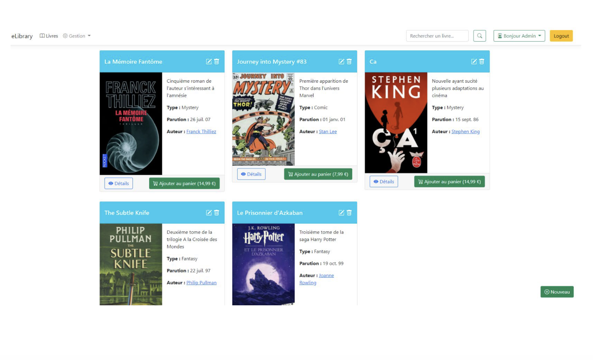

### TP - 2 Asp.NET Core

**Objectif:** Mettre en place les différentes notions d'aps.net core (controller, view, model,...)

- Le but de l'exercice est de réaliser une librairie virtuelle

Pour l’exercice, vous devrez vous servir de plusieurs contrôleurs : 
- un pour les livres.
- un pour les auteurs, un pour la gestion des ventes.
- un pour la gestion des connexions.

- Les contrôleurs des livres et des auteurs auront comme fonctionnalités de base le listing, l’ajout,
l’édition, la suppression des livres / auteurs (la suppression se fera via une confirmation qui affichera le descriptif de l’item sélectionné avant suppression effective). 
- Le contrôleur des livres aura également une fonctionnalité permettant de trier les livres (qui se fera dans l’interface via une barre
de recherche classique).
- Le contrôleur des ventes servira entre-autre à alimenter un panier, à afficher le panier, à confirmer la vente et à permettre à un administrateur d’avoir accès à toutes les ventes effectuées sur le site.
- Le contrôleur des comptes servira par exemple à la connexion et à la déconnexion des utilisateurs et de leur affectation de leurs droits qui seront stockés dans un cookie.

1. Dans un premier temps on réalisera les contrôleurs livres, auteurs.
2. Avec la partie session on peut réaliser les contrôleurs utilsateur et panier.

