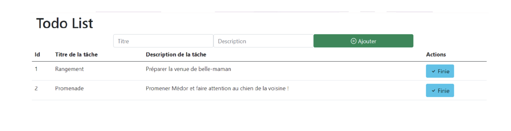

### TP 1 Asp.NET Core

**Objectif:** Mettre en place les différentes notions d'aps.net core (controller, view, model,...)

- Le but de l'exercice est de réaliser une TodoList permettant aux utilisateurs d’avoir accès à une liste de tâche se présentant
comme sur l’exemple ci-dessus. 
- Ces tâches pourront être terminées.
- Ces tâches pourrant être supprimées.

